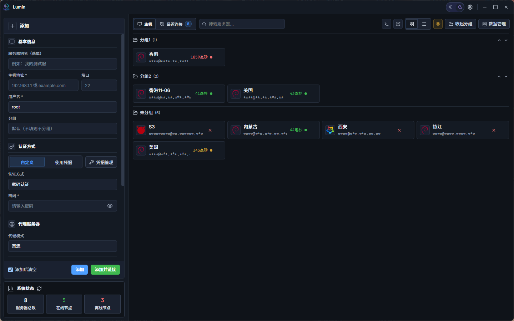
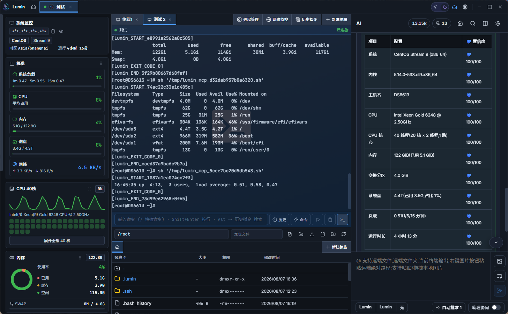

<div align="center">

# Lumin

**Lightweight, cross-platform SSH client for developers**

[](https://github.com/wmwlwmwl/Lumin-SSH/releases)
[](https://github.com/wmwlwmwl/Lumin-SSH/releases)
[](LICENSE)

[English](./README_EN.md) · [简体中文](./README.md)

</div>

---

## About

> **Android client** (separate repo, independent releases): [Lumin-SSH-Android](https://github.com/wmwlwmwl/Lumin-SSH-Android) · [Releases](https://github.com/wmwlwmwl/Lumin-SSH-Android/releases)

Lumin is a desktop SSH client for developers and operators. It combines **Go-native concurrency**, a **local WebSocket** terminal path, and **xterm.js** inside a Wails shell for low-latency sessions. Built-ins include a system resource probe, remote file manager (in-app and external editors), command history and completion, per-connection proxies, optional encrypted cloud sync, AI chat, and MCP — **with no agent installed on the server**.

<div align="center">
  
  <br /><br />
  
</div>

---

## Features

### Terminal & connection
- **Async PTY** — concurrent Go I/O; terminal bytes go over loopback WebSocket (ephemeral port + session token + Origin checks), not the Wails IPC hot path
- **Predictive local echo** — responsive typing on high-latency links
- **Multi-terminal tabs** — several terminals per SSH connection
- **Multi-session** — many hosts at once; tab menu: disconnect / close / reconnect
- **Local & serial terminals** — PowerShell, CMD, and installed WSL distros on Windows; local shells on macOS/Linux; direct serial-port sessions. WSL/Unix local sessions support the file manager and resource probe; native Windows shells support local files but not the probe; serial sessions are terminal-only
- **Terminal encoding** — per-host bidirectional conversion for UTF-8, GB18030/GBK/Big5, Japanese/Korean encodings, Windows/ISO-8859, IBM/OEM, and more
- **SSH channel usage** — session tabs show terminal, shared-file, and upload channel totals, with a warning near the server limit
- **Collapsible command blocks** — optional left gutter blocks to fold long output
- **Clickable URLs** — open in the system browser
- **Timestamps** — optional per-line markers aligned with scrollback
- **Hide secrets** — one-click mask for passwords/keys in the UI
- **Bash session hook** — on bash, a session-scoped `PROMPT_COMMAND` captures history/CWD (does **not** rewrite `.bashrc`) for history UI, completion, and AI

### Dashboard
- **Inline host editor** — left rail add/edit with Save or Save & Connect
- **Grid / table views**
- **Search** — name, host, tags, …
- **Latency checks** — **SSH Banner RTT** (better through some TUN/proxy setups) and **TCP Dial**; configurable interval or off; Banner mode uses a more conservative floor to reduce false security alerts
- **Tab overflow** — searchable dropdown when many tabs

### Server management
- **Save & Connect**
- **Clone** — full config including secrets and credential refs
- **Import / export** — all or selected hosts (plus referenced credentials and proxy nodes) as **plaintext JSON** or **encrypted `.lumin2`**; recovery password or custom password for ciphertext; auto-detect import; template download
- **Duplicate detection** — host + port + username
- **Groups**
- **OS icons** — Ubuntu, Debian, CentOS, RHEL, Rocky, Alma, Fedora, Arch, NixOS, Alpine, Kali, Gentoo, openSUSE, openEuler, OpenCloudOS, Anolis, TencentOS, Alibaba, AOSC, Oracle, FreeBSD, Windows, macOS, and more (assets under `frontend/public/`)
- **Credentials** — reusable auth material
- **Per-connection proxy** — direct, shared node, or custom SOCKS5 / HTTP
- **Initial paths** — separate terminal vs file-manager start dirs

### Resource probe
- **No agent** — deploys helper scripts on demand (e.g. `~/.lumin/probe.sh`)
- **Live metrics** — per-core CPU, memory, network, disks, …
- **GPU / RAID** when the environment supports it
- **Process tools** — list, search, signals; optional kill confirm
- **Panel side & refresh** — left or right; configurable interval

### Remote file manager
- Browse, upload, download, delete, rename, create, copy/move
- **Remote clipboard** — copy / cut / paste paths in-session
- **In-app editor** — syntax highlighting (~5MB cap)
- **External editor** — system or chosen app; save syncs back via fsnotify + debounce (~5MB); remembers path
- **Archive** — tar.gz (and related); optional double-click extract
- **Compressed multi-upload** — local tar.gz then remote extract
- **Chunked upload** — chunk size, file concurrency, per-file chunk concurrency, global in-flight cap
- **Transfer queue** with optimized transfer-channel concurrency and reuse
- **Large-directory performance** — virtualized file rows avoid mounting the entire directory at once
- **File locator** — find names in the current directory, navigate previous/next matches, and use keyboard controls
- **Type detection & refresh** — distinguish directories from symbolic links; refresh the current directory after terminal commands complete or the panel regains focus
- **Download conflicts** — ask / overwrite / skip / rename; size/mtime heuristics
- **chmod / chown**
- **Follow terminal CWD**
- **Drag-and-drop upload**
- **Copy remote path**
- **Layouts**
  - Workspace dock: **tabs / right split / bottom split**
  - File UI: **top-tab single pane** or **left-tab dual pane** (history + two lists)

### History, completion, quick commands
- Auto-capture executed lines into per-host and global history
- Search and resend
- Completion from history, quick commands, builtins, remote paths
- Quick-command library with groups and `p#` parameters
- **Pinned command bar** — keep quick commands above the terminal input and confirm before sending

### Credentials & proxy nodes
- Central credentials applied to many hosts
- SOCKS5 / HTTP nodes in **Settings → Network**; hosts and AI requests can reference them
- Export includes referenced proxy nodes

### AI chat & MCP
- In-app multi-turn chat with streaming and tool UX
- Providers: Compatible / Messages / Responses; built-in Kimi via local **uv** runtime
- Slash commands and `@` mentions (terminal / remote paths)
- Tool approval policies; reassign command terminals; review diffs/patches
- Context condense; conversation backups; editable task titles
- Collaboration-oriented flows in the AI panel
- **Built-in MCP** (Streamable HTTP) on `127.0.0.1:5779` — **on by default**, toggle in AI settings; **no HTTP token**; loopback + Origin friction only (**not** a same-user malware boundary)
- **MCP clients** — stdio / SSE / Streamable HTTP
- Caps on terminal output exposed to tools

#### Sample MCP tools
`list_connected_sessions` · `get_work_path` · `list_files` · `read_file` · `write_to_file` · `transfer_batch` · `transfer_list` · `execute_command` · `ask_followup_question` · `attempt_completion` · `search_replace` · `apply_diff` · `apply_patch` · `edit_file`

### Cloud sync
- **Your** WebDAV, Cloudflare R2 (S3-compatible), FTP, or SFTP
- Snapshot: hosts, credentials, quick commands, AI providers/global settings, proxy nodes, tombstones
- **With recovery password** → `.lumin2` (PBKDF2 + AES-GCM)  
  **Without** → **plaintext `.json`** (convenient, but the cloud can read secrets — use carefully)
- Merge + tombstones; auto-sync on/off; single backend or “all”; retention limit

### Local encryption
- First run creates a **32-byte** `lumin.key`
- Host passwords, private keys, passphrases, proxy passwords, credentials, recovery password, and some cloud account secrets are stored with **AES-256-GCM**
- **Note:** AI API keys and some node files are stored as app JSON and are **not** all wrapped by `lumin.key`. Cloud ciphertext uses the **recovery password**, a separate trust root from `lumin.key`

### Auto-update
- Checks GitHub Releases ~2.5s after startup; manual check in About
- HTTPS GitHub release assets only; optional mirrors
- **Mandatory SHA256** before install/replace (portable, installer, deb/rpm, dmg + codesign where applicable)

### Tray & single instance
- Close: ask every time / quit / tray
- Single instance; second launch focuses the first
- Tray show/quit; platform-specific force-foreground after long idle

### Themes, layout, i18n
- Light/dark (optional follow system)
- Theme packages with light/dark variants; copy between modes; optional AI theme-tuning mode
- Fonts for UI / terminal / AI; terminal wallpaper; theme shortcut in title bar
- Resizable probe, file manager, AI panel; persisted layout
- **28** language packs
- Custom terminal shortcuts; workspace memory (window + optional sessions)

### Runtime
- **Settings → Runtime**: install/detect **uv** for built-in Kimi and related modules

---

## Quick start

1. Download the build for your OS from [Releases](https://github.com/wmwlwmwl/Lumin-SSH/releases)
2. Run once — config dir is created automatically (table below)
3. Add a host on the dashboard → **Save** or **Save & Connect**
4. Optionally configure proxies, sync + recovery password, and AI providers

---

## Data layout

| OS | Config directory |
|----|------------------|
| Windows | `%APPDATA%\Lumin\config\` |
| macOS | `~/Library/Application Support/Lumin/config/` |
| Linux | `~/.config/Lumin/config/` |

| Path | Role |
|------|------|
| `lumin.key` | Local AES master key. **Back it up** — losing it makes locally encrypted fields unrecoverable on this machine |
| `connections.json` | Hosts (secrets AES-GCM) |
| `credentials.json` | Credential store |
| Sync backend JSON | WebDAV/R2/FTP/SFTP settings |
| `quick_commands.json` / `param_history.json` / `history/` | Commands |
| Sync control files | Mode, auto-sync, timestamps, tombstones |
| `recovery_password` | Recovery password (encrypted with `lumin.key`) |
| `ai_*.json` / `proxy_nodes.json` / `tasks/` | AI and proxy data |

> On Windows, WebView2 user data is fixed at `%APPDATA%\Lumin\`, alongside `config\`; renaming the portable executable does not create another browser-data directory.

---

## Updates

GitHub Releases for `wmwlwmwl/Lumin-SSH` → platform asset → SHA256 → install/replace.  
Version sources: `wails.json`, `frontend/src/config.js`, `frontend/package.json`, and `frontend/package-lock.json` — currently **1.2.5**.

---

## Settings tabs

| Tab | Contents |
|-----|----------|
| **General** | Language, confirms, close behavior, workspace memory, update mirrors, WebView GPU |
| **Network** | Latency protocol/interval, probe interval, proxy nodes |
| **File manager** | Follow CWD, archives, queue, dual pane, conflicts, chunked upload, … |
| **Runtime** | uv |
| **Appearance** | Fonts, terminal themes/wallpaper, UI theme packages, probe side, command blocks |
| **Shortcuts** | Terminal keybindings |
| **Sync & cloud** | Backends, recovery password, retention, auto-sync |
| **About** | Version, update check, links |

AI provider/MCP/backup options live in the **AI panel settings**, not these tabs.

---

## Build

- Go **1.26+**, Node 18+, Wails v2 CLI

```bash
go install github.com/wailsapp/wails/v2/cmd/wails@latest
git clone https://github.com/wmwlwmwl/Lumin-SSH.git
cd Lumin-SSH
wails build
# Windows installer (NSIS required):
wails build -nsis
```

Tagged releases (changelog + multi-platform packages): [.github/RELEASE_EN.md](.github/RELEASE_EN.md).

---

## Security notes

- **`lumin.key`** — local AES root. Loss ⇒ local encrypted vault unreadable. A recovery-password `.lumin2` cloud copy or plaintext export may still restore data elsewhere.
- **Recovery password** — without it, sync uploads **plaintext** secrets. Prefer a strong recovery password before enabling auto-sync.
- **Host keys** — verify fingerprints; rotation is detected.
- **Terminal WebSocket** — localhost only, token + Origin.
- **MCP** — `127.0.0.1:5779`, optional off; no token ⇒ same-user local processes can hit connected sessions. Not a malware boundary.
- **Updates** — trust GitHub + SHA256; compromised release can replace both binary and hash.

---

## FAQ

**How are passwords stored?**  
Local AES-256-GCM with `lumin.key`. Cloud uses recovery password (`.lumin2`) or plaintext JSON.

**Multi-machine sync?**  
Settings → Sync & cloud → your WebDAV/R2/FTP/SFTP. Set a recovery password first when possible.

**Does clone copy secrets?**  
Yes.

**Credentials vs inline passwords?**  
Credentials are shared entities; edit once, apply many.

**External edit?**  
Open in file manager → in-app editor → system/chosen editor; saves sync back automatically.

**AI / MCP?**  
Configure in the AI panel. MCP listens on loopback when enabled.

**Desktop OS support?**  
Windows, macOS, Linux.

---

## Sponsor

If Lumin helps you, sponsorship is appreciated:

<div align="center">
  <table>
    <tr>
      <td align="center">
        
        <br/><strong>WeChat</strong>
      </td>
      <td align="center">
        
        <br/><strong>Alipay</strong>
      </td>
      <td align="center">
        
        <br/><strong>QQ</strong>
      </td>
    </tr>
  </table>
</div>

---

## Contributing

- Bugs: [Issues](https://github.com/wmwlwmwl/Lumin-SSH/issues/new)
- PRs: match existing style; keep I/O non-blocking

---

## License

See [LICENSE](LICENSE) (**Lumin SSH Source License 1.1**, same family as Android).

| | |
|--|--|
| **Allowed** | Non-commercial use, study, research, public forks (keep license/attribution; redistribution must be **source-available**) |
| **Not allowed** | Commercial use (sale, paid distribution, commercial embedding, for-profit services, etc.; see LICENSE) |
| **Not allowed** | Public distribution only in encrypted/packed/heavily obfuscated form without corresponding readable source |

**Scope:** This license covers **original code in this repo**. Third-party components remain under **their own licenses**.

This is a custom license, **not legal advice**. Consult a lawyer for commercial edge cases.

> Desktop and Android ship from **separate repos**. This repo’s Releases are **Desktop only**. Android: [Lumin-SSH-Android](https://github.com/wmwlwmwl/Lumin-SSH-Android).
